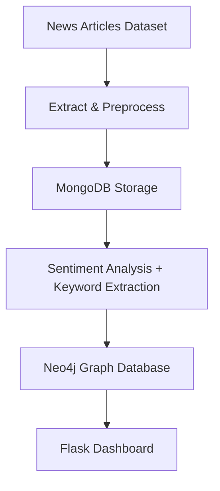

# brand-sentiment-etl

An **automated ETL pipeline** for **brand sentiment analysis** from news articles, powered by:
- **MongoDB** → Storing cleaned article data  
- **Neo4j** → Modeling brand–keyword relationships as graphs  
- **Flask** → Serving an interactive dashboard visualization for results  

This project demonstrates **data engineering, NLP, and visualization skills** by integrating multiple technologies into a production-style pipeline.

---

## Problem Statement

Marketing teams need to assess **brand reputation** by analyzing how brands are mentioned in the media.  
Manually tracking online mentions, sentiment, and brand associations is **time-consuming** and **error-prone**.  

This project solves the problem by:
- Automating **extraction → transformation → loading (ETL)** of news articles  
- Running **sentiment analysis and keyword extraction**  
- Building a **graph database** to capture brand–keyword associations  
- Serving results through a **visual dashboard**  

---

## ETL Pipeline Workflow



---

## Steps
**1. Extract**
Input: News articles dataset (nyt_articles_subset.parquet).
Sources can be extended to APIs (NewsAPI, GDELT, RSS feeds).

**2. Transform**
Clean and normalize text.
Run sentiment analysis (positive/negative/neutral).
Extract brands & adjectives.

**3. Load**
Store structured articles in MongoDB.
Insert brand–keyword relationships into Neo4j.

**4. Visualize**
Serve results in Flask dashboard.
Charts: brand mentions trend, adjectives bar chart, word clouds, Neo4j graph.

---

## Dashboard Features
**1.** **Brand Mentions Over Time**
Line chart showing how often a brand appears in articles over time.
Helps detect sudden spikes (e.g., Adidas during World Cup).

**2.** **Top Adjectives per Brand**
Bar chart of adjectives describing the brand.
Reveals whether the tone is positive, neutral, or negative.

**3.** **Word Cloud**
Highlights the most frequent adjectives associated with the brand.

**4.** **Graph Visualization**
Neo4j-powered graph of brands and related keywords.

---

## Folder Structure

```text
brand-sentiment-etl/
│
├── data/                      
│   └── nyt_articles_subset.parquet        # Input dataset
│
├── notebooks/                 
│   └── brand_analysis_mongo_neo4j.ipynb   # Exploratory analysis
│
├── src/                       
│   └── app.py                           # Flask application
│
├── templates/                
│   └── index.html                       # Flask dashboard HTML
│
├── static/                    
│   ├── Neo4j_graph.png                  # Graph visualization export
│   └── logos/                           # Brand logos
│
├── docs/                     
│   └── Brand_Sentiment_ETL_Presentation.pptx
│
├── requirements.txt           
└── README.md
```

---

## Technologies Used

**Python** 3.9+
**MongoDB & PyMongo** – Data storage
**Neo4j** & **neo4j Python driver** – Graph database modeling
**NLTK** & **spaCy** – NLP, tokenization, sentiment analysis
**pandas** & **numpy** – Data wrangling
**matplotlib** & **wordcloud** – Visualization
**Flask** – Interactive web dashboard
**HTML**/**CSS** – Frontend templates

---

## Dataset Details

Source: NYT Articles Dataset on Kaggle
Format: Parquet (nyt_articles_subset.parquet)
Fields:
    id: Unique article ID
    headline: Article headline
    abstract: Summary of the article
    pub_date: Publication date
    keywords: Tags and extracted entities
    section_name: News section (e.g., Business, Sports)
    lead_paragraph: Main text used for sentiment & keyword extraction

---

## Acknowledgements

Special thanks to colleagues who helped in brainstorming and testing:
Claire Costello
Connor Wang
Deheta Emma Akue
Kai Lun Pao


